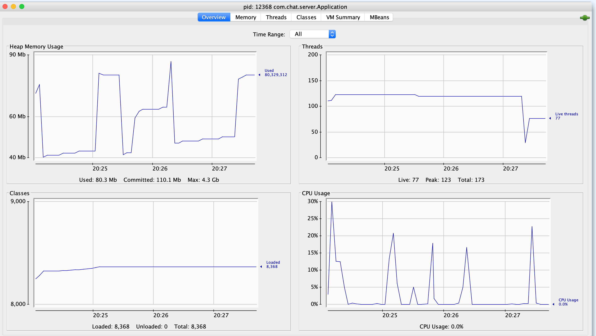

Reactive microservice on Tomcat
-------------------------

https://developer.okta.com/blog/2018/09/21/reactive-programming-with-spring

```bash
mvn clean package
## mvn clean spring-boot:run

java -jar target/chat-server-1.0-SNAPSHOT.jar
2023-04-16 16:19:30.946  INFO 69458 --- [           main] o.s.b.w.embedded.tomcat.TomcatWebServer  : Tomcat initialized with port(s): 8080 (http)
2023-04-16 16:19:30.985  INFO 69458 --- [           main] o.apache.catalina.core.StandardService   : Starting service [Tomcat]
2023-04-16 16:19:30.985  INFO 69458 --- [           main] org.apache.catalina.core.StandardEngine  : Starting Servlet engine: [Apache Tomcat/9.0.16]
2023-04-16 16:19:31.112  INFO 69458 --- [           main] o.a.c.c.C.[Tomcat].[localhost].[/]       : Initializing Spring embedded WebApplicationContext
2023-04-16 16:19:31.112  INFO 69458 --- [           main] o.s.web.context.ContextLoader            : Root WebApplicationContext: initialization completed in 1442 ms
2023-04-16 16:19:31.616  INFO 69458 --- [           main] o.s.s.concurrent.ThreadPoolTaskExecutor  : Initializing ExecutorService 'applicationTaskExecutor'
2023-04-16 16:19:32.036  INFO 69458 --- [           main] o.s.b.w.embedded.tomcat.TomcatWebServer  : Tomcat started on port(s): 8080 (http) with context path ''
2023-04-16 16:19:32.040  INFO 69458 --- [           main] com.chat.server.ChatApplication              : Started Application in 2.937 seconds (JVM running for 3.449)

```

reactive client
------

```bash
λ curl -v localhost:8080/v2/chat
*   Trying ::1...
* TCP_NODELAY set
* Connected to localhost (::1) port 8080 (#0)
> GET /v2/chat HTTP/1.1
> Host: localhost:8080
> User-Agent: curl/7.54.0
> Accept: */*
> 
< HTTP/1.1 200 
< Content-Type: application/json;charset=UTF-8
< Transfer-Encoding: chunked
< Date: Sun, 07 Apr 2019 01:35:42 GMT
< 
* Connection #0 to host localhost left intact
[{"message":"hi how can i help you"},{"message":"Please see stuff"},{"message":"whatever"}]
```

TODOs
- see threads usage
- add reactive client project example

Perf
----

```bash
ab -n 15000 -c 100 -k localhost:8080/heartbeat
This is ApacheBench, Version 2.3 <$Revision: 1843412 $>
Copyright 1996 Adam Twiss, Zeus Technology Ltd, http://www.zeustech.net/
Licensed to The Apache Software Foundation, http://www.apache.org/

Benchmarking localhost (be patient)
Completed 1500 requests
Completed 3000 requests
Completed 4500 requests
Completed 6000 requests
Completed 7500 requests
Completed 9000 requests
Completed 10500 requests
Completed 12000 requests
Completed 13500 requests
Completed 15000 requests
Finished 15000 requests


Server Software:        
Server Hostname:        localhost
Server Port:            8080

Document Path:          /heartbeat
Document Length:        38 bytes

Concurrency Level:      100
Time taken for tests:   3.429 seconds
Complete requests:      15000
Failed requests:        0
Keep-Alive requests:    0
Total transferred:      2355000 bytes
HTML transferred:       570000 bytes
Requests per second:    4374.37 [#/sec] (mean)
Time per request:       22.860 [ms] (mean)
Time per request:       0.229 [ms] (mean, across all concurrent requests)
Transfer rate:          670.68 [Kbytes/sec] received

Connection Times (ms)
              min  mean[+/-sd] median   max
Connect:        0    6   4.0      5     107
Processing:     1   17  10.9     14     199
Waiting:        1   12   9.3     10     168
Total:          5   23  11.3     20     199

Percentage of the requests served within a certain time (ms)
  50%     20
  66%     24
  75%     27
  80%     29
  90%     37
  95%     42
  98%     49
  99%     59
 100%    199 (longest request)
```

worst

```bash
ab -n 15000 -c 100 -k localhost:8080/heartbeat
This is ApacheBench, Version 2.3 <$Revision: 1843412 $>
Copyright 1996 Adam Twiss, Zeus Technology Ltd, http://www.zeustech.net/
Licensed to The Apache Software Foundation, http://www.apache.org/

Benchmarking localhost (be patient)

Completed 1500 requests
Completed 3000 requests
Completed 4500 requests
Completed 6000 requests
Completed 7500 requests
Completed 9000 requests
Completed 10500 requests
Completed 12000 requests
Completed 13500 requests
Completed 15000 requests
Finished 15000 requests


Server Software:        
Server Hostname:        localhost
Server Port:            8080

Document Path:          /heartbeat
Document Length:        38 bytes

Concurrency Level:      100
Time taken for tests:   17.229 seconds
Complete requests:      15000
Failed requests:        0
Keep-Alive requests:    0
Total transferred:      2355000 bytes
HTML transferred:       570000 bytes
Requests per second:    870.63 [#/sec] (mean)
Time per request:       114.860 [ms] (mean)
Time per request:       1.149 [ms] (mean, across all concurrent requests)
Transfer rate:          133.48 [Kbytes/sec] received

Connection Times (ms)
              min  mean[+/-sd] median   max
Connect:        0  108 1265.2      4   15559
Processing:     0    7   2.5      6      29
Waiting:        0    5   2.1      5      26
Total:          0  115 1265.2     10   15566

Percentage of the requests served within a certain time (ms)
  50%     10
  66%     11
  75%     12
  80%     13
  90%     14
  95%     17
  98%     20
  99%     30
 100%  15566 (longest request)
```


